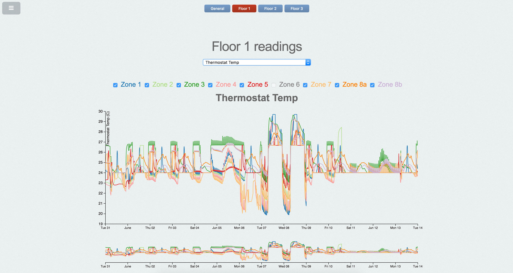

# Final report - Programmeerproject
### Gosia's strijders

## Beschrijving
Deze visualisatie is gemaakt voor Mini Challenge 2 van de [VACommunity](http://vacommunity.org/2016+VAST+Challenge%3A+MC2). Het betreft fictieve data van het fictieve bedrijf GAStech. Het doel is om patronen of gekkigheden te ontdekken in de sensormetingen, en te bedenken wat de reden ervoor kan zijn. Daarvoor zijn de metingen van de HVAC sensoren gevisualiseerd met linegraphs, voor het hele gebouw en voor elke verdieping opgesplitst in HVAC zones. In deze linegraph zitten ook de metingen voor Hazium verwerkt voor de vier zones waar de Hazium sensoren geplaatst zijn. Daarnaast beschikt het gebouw ook over prox sensoren, zowel vaste als mobiele (Rosie de robot). Deze meten wanneer iemand met een prox card in de buurt is. Deze prox sensormetingen zijn ook gevisualiseerd in linegraphs die laten zien hoeveel keer een prox card is gedetecteerd in een uur. Voor de HVAC sensormetingen en de prox sensormetingen zijn ook heatmaps gemaakt, die in een floorplan de waarden van de sensoren laten zien. Als laatst zijn er parallel coordinates graphs, die laten zien hoe vaak een specifieke werknemer op een dag gedetecteerd is. Dan kan op nog een specifieker niveau gekeken worden of de werknemers iets geks doen.  

</img>

## Technische functionaliteit
De functionaliteit voor de verschillende graphs is opgesplitst in meerdere files, maar alles bevindt zich wel op één pagina. Elke soort graph is ook weer ondergesplitst per verdieping als de data ook is opgesplitst per verdieping. Dit is bijvoorbeeld het geval bij de HVAC data, die is opgesplitst per verdieping. Functionaliteit voor data die in één bestand staan is in het algemeen niet opgesplitst per verdieping, maar staat in één bestand om de data niet meerdere keren te hoeven inladen. De visualisatie heeft componenten voor de HVAC data (die voor het gemak ook de Hazium data bevat), fixed-prox data (voor de vaste sensoren in de prox zones) en mobile-prox data (van Rosie de robot). De HVAC- en prox-data zijn gevisualiseerd in linegraphs en heatmaps. De prox-data is daarnaast ook gevisualiseerd in een parallel coordinates graph.

### HVAC - Linegraphs
De HVAC data is onder andere gevisualiseerd in linegraphs, die de data over de gehele periode van 2 weken plot. Er kan op de graphs ingezoomd worden met een brush, zodat anomalies uitgelicht kunnen worden. Er zijn dropdowns voor de soort meting. Voor de verdiepingen zijn de metingen vaak ook per zone gesplitst: daarom hebben deze linegraphs ook bijbehorende checkboxes waarmee de lijnen per zone getoggled kunnen worden. Bij het hoveren over een lijn vervagen de andere lijnen: zo kan gefocust worden op één specifieke lijn als de grafiek bijvoorbeeld een warboel is. In sommige gevallen moeten sommige checkboxes ook uit worden gezet om het overzichtelijk te maken omdat enkele kleuren erg donker zijn en dus door kunnen bloeden ookal staat hun doorzichtigheid vrij hoog.

### HVAC - Heatmap

### Prox data - Linegraphs
De fixed-prox data zijn ook gevisualiseerd in linegraphs. Deze zijn opgesplitst in data over het gehele gebouw, waarbij de lijnen over de verdiepingen apart gaan, en per verdieping, waarbij de lijnen over de (prox) zones apart gaan. Deze linegraphs hebben dezelfde functionaliteit als de linegraphs voor de HVAC data: er zijn dropdowns, checkboxes en hoveren over een lijn vervaagt de anderen. De fixed-prox data is geaggregeerd per uur, omdat de prox sensoren niet na een vast aantal minuten een meting loggen, zoals de HVAC sensoren dat wel doen. De prox sensoren loggen namelijk meteen een meting als deze een prox card detecteren maar dat gebeurt niet na een vast aantal minuten. Voor uren waarin geen prox card gedetecteerd is, wordt de waarde 0 toegekend, zodat de linegraphs niet interpoleren over uren waar er niks is gelogd.

### Prox data - Heatmap

### Prox data - Parallel coordinates & Tabel heatmap

## Implementatieproblemen

### Dataverwerking
De data is op zich in een goed format opgeslagen. De data is verkrijgbaar in csv of json format. De csv voor de HVAC data was echter niet compleet: data vanaf verdieping 2, zone 7 is er niet te vinden. De json voor de HVAC data is opgesplitst in 4 bestanden: general (gehele gebouw) en floor1/2/3 (per verdieping). Het vervelende is dat een json format niet gemakkelijk in een database te importeren is. Een csv format is dat wel maar de csv is niet compleet. Uiteindelijk hebben we besloten om de data dan toch lokaal in te laden, wat de visualisatie trager maar compleet maakt. De data wordt nu één keer ingeladen aan het begin, wat even kan duren, maar als het eenmaal geladen is kan er vrij geswitcht worden tussen de visualisaties. De data is helaas niet geheel consistent. Daarom is het verwerken van de data niet op een elegante manier gedaan. De data per timestamp zit in zijn geheel in één object, en is niet gesplitst per zone. En daarbij wordt niet elke identifier afgesloten met een spatie, dat is namelijk soms een dubbelepunt. Daarom is het verwerken vrij omslachtig gedaan.

### Immediately Invoked Function Expressions (IIFEs)
Het idee was eerst om alle functionaliteit van het inladen van de data te splitsen: het initialiseren/updaten van de graphs zou dan in het gedeelde bestand dimensions.js komen. Het probleem is dat die functies variabelen gebruiken die geinitialiseerd worden in de datalader. De functionaliteit brak toen de datalader in een IIFE werd gegooid, om zo min mogelijk globale variabelen te gebruiken. Daarom moest de functionaliteit in de IIFE zelf gedefinieerd worden. Dat werkt het doel om het data inladen en de functionaliteit te splitsen wel tegen, maar op deze manier zijn er veel minder globale variabelen wat het in elkaar zetten van alle visualisaties makkelijker maakt. Er is dan minder kans dat er een conflict is tussen variabelenamen.

### Combineren
De visualisaties zijn allemaal apart gemaakt, door andere mensen. Er is wel in het achterhoofd gehouden dat alles uiteindelijk bij elkaar moest komen, maar het blijft lastig om zó te programmeren dat er nul conflicten zijn tussen de bestanden. Dat is een probleempje bij het combineren van alle visualisaties. Het handige aan Javascript is dat veel in een IIFE gestopt kan worden om conflicten te voorkomen, maar omdat de functionaliteit en het inladen van de data meestal gesplitst is in meerdere bestanden kan het moeilijk zijn om een goede manier te vinden om een IIFE te maken. Daarnaast kan het moeilijk zijn om bij zo veel visualisaties unieke identifiers te kiezen in de HTML bestanden.

### Snelheid
De json bestanden zijn veel groter dan de csv bestanden, maar ze zijn compleet. Omdat de bestanden zo groot zijn, duurt het inladen bij het laden van de pagina best lang. Gelukkig hoeft er maar één keer data ingeladen te worden, en kan er daarna vrij gespeeld worden met de visualisaties. Het idee was eerst om een database te gebruiken om specifieke data op te vragen. Het is uiteindelijk niet gelukt om de data efficient in een database in te laden. Daarom zijn we overgestapt naar het lokaal inladen van de data. Een database zou de visualisatie veel sneller kunnen maken door alleen de data in te laden (op te vragen) die gevisualiseerd wordt, zodat niet onnodig gewacht hoeft te worden op data die niet gevisualiseerd wordt.

## Keuzes

### Design
Het uiteindelijke product verschilt vrij significant van het product wat beschreven is in het design document. Het product in het design document draaide eigenlijk geheel om de prox data en het tracken van een individu over de tijd. Dat was al erg gedetailleerd. Het uiteindelijke product geeft een veel beter overzicht van alle data, door ze niet meteen te laten inzoomen op een specifiek persoon of specifieke zone. Bij het ontdekken van een gekkigheid in het overzicht kan er wel ingezoomd worden, maar het overzicht van alle data staat eerst centraal. Dit is zo gekozen omdat het intuitiever is om eerst op een algemeen niveau de data te bekijken: de lijnen met elkaar vergelijken over de gehele periode. Bij het spotten van iets geks kan er specifieker ingezoomd worden, wat in de buurt komt van het product wat we eerst in gedachten hadden.

### Dataopslag
Het idee aan het begin was om de data in een database op te slaan voor efficiente verwerking van de data. Er wordt dan alleen data opgevraagd die op dat moment nodig is voor de visualisaties. De data kan van tevoren in een database worden ingeladen. Uiteindelijk werd dit wel een probleem. Het laden van een database met csv bestanden gaat vrij makkelijk, het is slechts een kwestie van uploaden van het bestand en aangeven dat de header de namen van de kolommen bevat en wat de separators zijn. De data van de challenge hebben twee problemen opgeleverd. Ten eerste was de eerste csv (building.csv) al niet compleet. De metingen vanaf verdieping 2, zone 7 staan niet in de csv en missen dan in de database. Dat maakt het bestand niet bruikbaar. Databases zoals MySQL en postgreSQL bieden niet de mogelijkheid om een json in een database te importeren. En omdat het zo'n 8 json bestanden betreft zou het ongelofelijk lang duren om de data met de hand in de database in te laden. Ten tweede zijn de csv bestanden erg inconsistent. De separators van de headers in de csv bestanden zijn vaak slechts een komma, maar in andere regels verschilt dat en het verschilt soms zelfs per kolom: komma of komma gevolgd door een spatie. Dit maakt de dataset erg moeilijk om mee te werken en de json bestanden hebben dit probleem niet.
